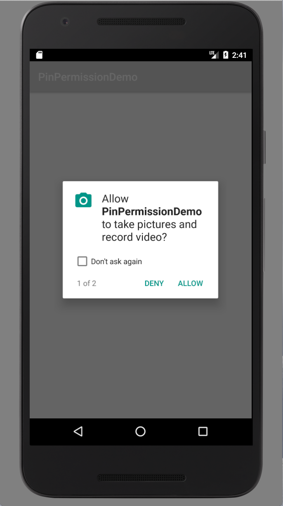

# Android Permission Checker

> Pin Permission

귀찮은 안드로이드 권한 요청을 간단하게할 수 있습니다.



``` Java
// 체크 되어 있는지 확인
Log.i("Log", PinPermission(this).checkPermission(Manifest.permission.WRITE_CALENDAR).toString())

// 필요한 Permission요청
PinPermission(this)
        .addPermission(android.Manifest.permission.CAMERA)
        .addPermission(android.Manifest.permission.READ_EXTERNAL_STORAGE)
        .setPermissionGranted {
           Toast.makeText(this, "Yeah", Toast.LENGTH_SHORT).show()
        }
        .setPermissionDenied {
           Toast.makeText(this, "No", Toast.LENGTH_SHORT).show()
        }
        .check()
```
